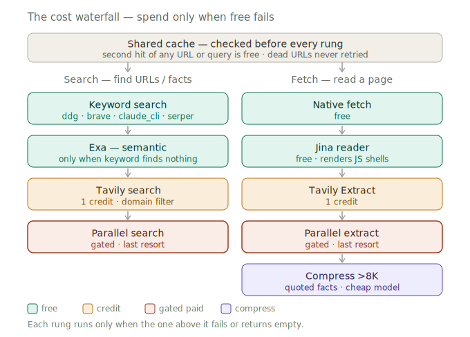

# gtm-research

## A cost-optimized web-research engine for GTM enrichment — free-first, cached, source-verified.

Give it a company or person (or a list) and the fields you want, and it returns
**source-verified rows** — each fact carrying the URL that proves it — by spending the
**cheapest provider rung that works** and caching results across runs. It's the research
layer: the part that turns "who are these accounts, really?" into cited, structured data
you can drop into a CSV or CRM.

It runs **standalone**, and it's a drop-in cached upgrade for
[gtm-pipeline](https://github.com/kkrlstrm/gtm-pipeline)'s `web_research` capability —
same `.claude/workflows` runtime, same `DATABASE_URL`, same BYOK/local-env conventions.

```
/research Acme Corp, Globex, Initech — find HQ city, employee count, CEO, and their CRM
```

## The idea: spend money only when free fails

Web research costs money (search credits are a capped resource). So every step tries the
**cheapest rung first** and only escalates on failure — and a shared cache means the second
run of any URL or query is free.



Dead URLs (404/410/401) hard-stop and are negative-cached — never retried. Long pages are
compressed to quoted facts by a cheap model before they reach your research agent. The full
rung-by-rung tables are in [docs/the-waterfall.md](docs/the-waterfall.md).

Rung order, budgets, and gates live in [`config/research-waterfall.yaml`](config/research-waterfall.yaml)
— **add or reorder a rung by editing config, not code.** Every rung auto-skips when its API
key is absent, so a partial key set (even *zero* keys — DuckDuckGo + native fetch need none)
still gives a working, cheaper waterfall.

## What it actually costs

Worked example: enrich **1,000 companies**, ~3 web operations each (one search + ~two page
reads) = **3,000 operations**. The waterfall absorbs the bulk on free rungs and pays only on
the tail that falls through.

| Tier | Share | Ops | Unit | Cost |
|---|---:|---:|---|---:|
| **Free** — cache hit · ddg/brave · native fetch · Jina | 88% | 2,640 | $0 | **$0.00** |
| **Tavily credit** — JS-walled / blocked pages | 11% | 330 | free ≤1k/mo, then ~$0.005 | **$0.00–1.65** |
| **Parallel** — gated last resort (off unless you enable it) | 1% | 30 | $0.005 | **$0.15** |
| **Digest** — compress long pages to quoted facts | ~600 pages | — | ~$0.001 | **$0.60** |
| | | | **cold-run total** | **≈ $0.75 – $2.40** |

Against an **all-premium baseline** (a paid search/enrich API at ~$0.005/call): 3,000 × $0.005
= **$15.00 / 1,000** — and that's before re-runs. The waterfall is **~6–20× cheaper cold**, and
because the cache is shared across runs, the **second** pass over an overlapping set of domains
is mostly cache hits — **≈ $0**. The more you research, the wider the gap.

> These resolution rates are an illustrative model, not a benchmark — your mix depends on how
> many target sites are static (free) vs. JS-walled (a credit). The point is structural: free
> rungs carry the body, paid is the long tail, and `research.v_run_cost_split` shows you the
> real split for *your* corpus after any run.

## What you get that generic enrichment doesn't

- **Source discipline.** Every field is `value + verified=true + source_url`, or blank +
  "NOT FOUND — searched X", or a labeled `UNVERIFIED` guess. Never invented. Emails are
  confirmed against a real directory, never guessed-and-verified.
- **A shared cache.** Web facts are client-agnostic, so one cache serves every run — the CEO
  you fetched last week is free this week.
- **Cost telemetry (optional).** When a Postgres DSN is set, every run/entity/rung is recorded,
  and `research.v_run_cost_split` tells you whether search credits or model turns were the real
  spend. A verified-rate **watchdog** pauses a run if a provider silently goes dark.
- **The "do we already know them?" column (optional).** Match each company against your own
  `known_companies` table — the GTM signal generic tools can't produce.

## Quick start

```bash
git clone https://github.com/kkrlstrm/gtm-research && cd gtm-research
pip install -r requirements.txt          # requests + PyYAML (+ optional extras)
cp .env.example .env                      # fill in only the keys you have (zero is fine)
set -a && source .env && set +a

# A free search and a free page read — no keys, no database needed:
python3 bin/research-search.py query "Acme Corp headquarters" --json
python3 bin/page-digest.py "https://www.acme.com/about" --entity "Acme Corp" --want "HQ city, CEO"
```

For a full multi-entity run, invoke the **`entity-research` workflow** from Claude Code
(see [`.claude/commands/research.md`](.claude/commands/research.md)) or wire it into gtm-pipeline
([docs/integrating-with-gtm-pipeline.md](docs/integrating-with-gtm-pipeline.md)).

## Telemetry + cache (optional, local or hosted Postgres)

Unset = it just runs (no cache, no telemetry). To turn it on, point at **any** Postgres —
**local** or hosted:

```bash
createdb gtm_research                     # local Postgres
export RESEARCH_DATABASE_URL=postgresql://localhost:5432/gtm_research
psql "$RESEARCH_DATABASE_URL" -f storage/postgres/schema.sql
# optional "do we already know them?" table:
psql "$RESEARCH_DATABASE_URL" -f storage/postgres/known-companies-optional.sql
```

It falls back to `DATABASE_URL`, so dropped into a gtm-pipeline checkout it shares that
project's database automatically. See [docs/local-postgres.md](docs/local-postgres.md).

## Layout

```
research_engine/   the engine: waterfall policy, web fetch/search, cache+telemetry, free search rungs
providers/         optional escalation rungs (exa, jina, parallel) — each auto-skips without its key
bin/               the CLIs: research-search, page-digest, research-run, known-xref
config/            research-waterfall.yaml — the ordered cost policy
storage/postgres/  schema.sql (cache + telemetry) + known-companies-optional.sql (internal xref)
.claude/           the entity-research workflow + the /research command
docs/              quickstart, architecture, the-waterfall, local-postgres, integrating-with-gtm-pipeline
```

## How it relates to gtm-pipeline

`gtm-pipeline` builds the **list** (discover → source → qualify → enrich → activate).
`gtm-research` is the **research engine** underneath the enrichment: a cached, free-first,
source-verified `company_search` / `company_enrich` / `people_search` provider. Use it on its
own for ad-hoc account research, or drop it in as a cached `web_research` upgrade.

## License

[Apache 2.0](LICENSE). BYOK, local-env-only: secrets are read from your environment and sent
only to each provider's own API — this engine never fetches a key over the network. See
[SECURITY.md](SECURITY.md).
